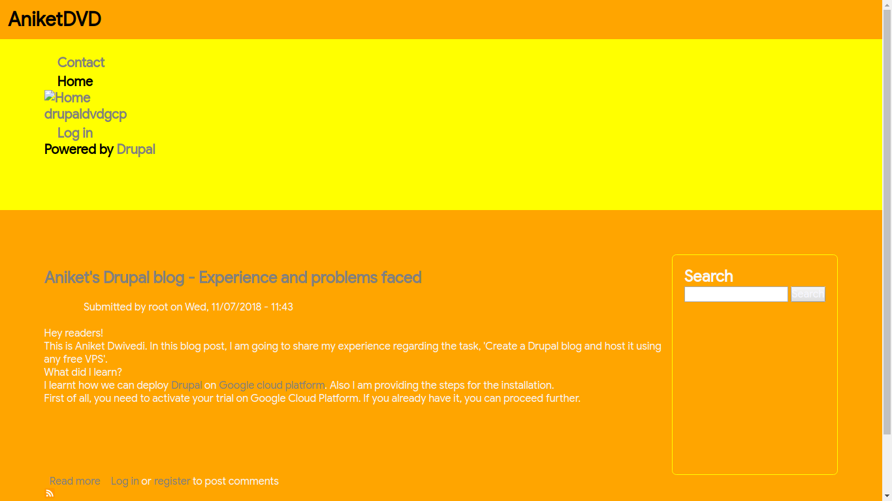
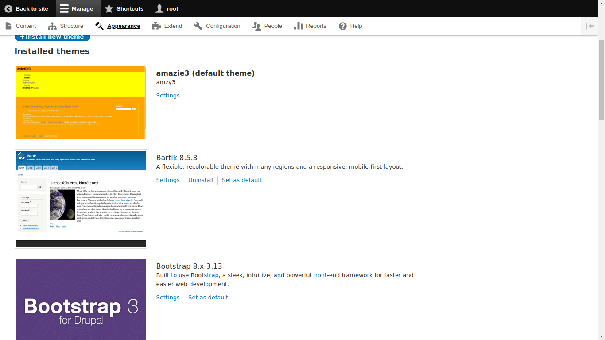

# amazie3

### What is Amazie?
Amazie is a Drupal 8 theme

### How do you use it in your Drupal 8 site?
Super easy... Go to your D8 root and you can find /themes folder
Extact this downloaded archive there and you are ready to rock!

### Usage in localhost:
* Open your admin panel in D8 site
* go to appearance > find the theme > install and set as default

### using on a live site: 
* Again, in you admin panel go to appearance
* Download and upload it on the site. 
--let that install--
* done!!!

### inheritance
We want the 'base theme' to be 'classy'. This part is quite simple. We make a key called 'base theme' in our *.info.yml* file and this makes drupal know that it has to fetch classy theme as its base theme.
```base theme: classy``` **or** ```'base theme': classy```
Classy is already present in the drupal core. 
You can find it in ```/drupal/core/themes/```
##### what is inherited ? 
When we set the base theme to classy, we can simply inherit the libraries and stylings.
Though the regions are not inherited. That means if there are regions in classy say, ```header, footer, content, sidebars, highlighted sections etc, ``` it won't be inherited in your theme. 
We will have to declare the regions in our *.info.yml* file under the key ```regions:```

### MORE:
You can even use other themes as base themes. Like bartik uses classy as base.
One can also make sub-sub-themes (sub-theme using a sub-theme as base theme)
Do checkout the official Drupal Documentation for usage and implementation:
* [making a sub-sub-theme](https://www.drupal.org/docs/8/theming-drupal-8/creating-a-drupal-8-sub-theme-or-sub-theme-of-sub-theme)

## And it looks like...


## You can see the screenshot is also being displayed in our Admin panel of Drupal Site. 
### How? Drupal identifies the ```screenshot.png``` in the root directory of your theme.


*Google Code-in 2018*
